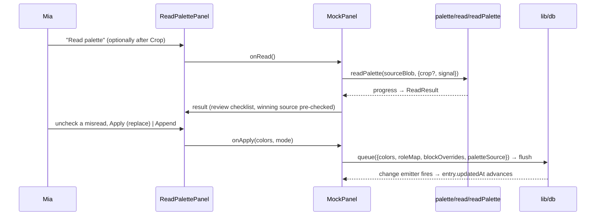
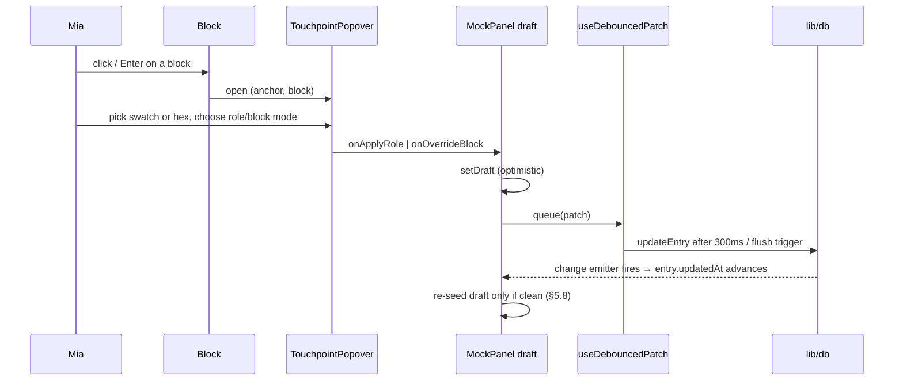

# ui_rover Architecture Documentation

## 1. How to Read This Document

This describes ui_rover **v0.2.0 as built**: the capture → palette/mock → library MVP (`docs/1-plans/F_0.1.0_mvp-capture-library.plan.md`) plus the v0.2.0 read pipeline — OCR of printed hex codes, swatch-blob detection, and crop — that replaced whole-image quantize as the primary way a palette entry gets its colors (`docs/1-plans/F_0.2.0_read-the-palette.plan.md`). No section is "(planned)" anymore; when the next feature lands, update the affected sections per `docs/ARCHI-rules.md`. Audience: Mia + any agent doing TRIP work in this repo.

## 2. Overview

ui_rover is a personal UI/UX swipe file. Mia saves Instagram and Threads posts as one of two entry kinds:

- **Design entries** — a post showing a UI/UX design. Stored as framed screenshots with tags and notes; optionally, "Extract palette" runs the same **read** (§12) on a chosen image and reveals the wireframe mock beneath, without changing the entry's kind.
- **Palette entries** — a post showing a color palette. Colors are **read** from the card, not just extracted from the whole screenshot: OCR of printed hex codes first, swatch-blob shapes second, whole-image quantize last, resolved automatically on save and reviewed in a panel on the entry page. A crop tool lets Mia point the reader at the card when auto-detection misses. The result previews on a wireframe mock (11 selectable layout templates) where every block is a touchpoint to reassign its color.

Hard constraint: **no Meta/Instagram/Threads API, no scraping.** The post URL is the bookmark key; the post image comes from a pasted or dropped screenshot. Everything runs client-side, single-user, no backend.

High-level: static SPA (HashRouter) → browser-only processing (Canvas for palette extraction) → IndexedDB for persistence (`idb`, with an in-memory fallback) → JSON export/import as the backup story.

## 3. Technology Stack

| Layer | Choice | Version |
| --- | --- | --- |
| Runtime | Node (nvm) | 24.14.1 |
| Build | Vite | 8.3.0 |
| UI | React | 19.2.8 |
| Language | TypeScript (strict, `erasableSyntaxOnly`, `verbatimModuleSyntax`) | ~6.0.2 |
| Routing | react-router (`HashRouter`) | 8.4.0 |
| Styling | Tailwind CSS v4 via `@tailwindcss/vite` | 4.3.3 |
| Storage | IndexedDB via `idb`, in-memory `Map` fallback | idb 8.0.3 |
| IDs | `ulid` | 3.0.2 |
| Lint | oxlint (react, typescript, oxc plugins) | 1.81.0 |
| Tests | Vitest + jsdom + Testing Library + fake-indexeddb | vitest 5.0.1, jsdom 29.1.1, @testing-library/react 16.3.3, @testing-library/jest-dom 7.0.1, @testing-library/user-event 14.6.7, fake-indexeddb 6.2.5 |
| OCR | tesseract.js (+ `tesseract.js-core`) + `@tesseract.js-data/eng` | tesseract.js 7.0.0, tesseract.js-core 7.0.0, @tesseract.js-data/eng 1.0.0 |

Tesseract's runtime assets (worker script, three LSTM-only wasm core builds, `eng` language data — see §12) are copied from `node_modules` into `public/ocr/` by `scripts/copy-ocr-assets.mjs`, run via `predev`/`prebuild` (§6). `public/ocr/` is generated, never committed (`.gitignore`).

## 4. Project Structure

```
ui_rover/
├── index.html
├── vite.config.ts        # react() + tailwindcss() plugins; vitest `test` block (jsdom, setupFiles, globals: false)
├── tsconfig*.json         # project references: app + node
├── .oxlintrc.json
├── docs/                  # TRIP workflow: ARCHI.md, 1-plans/, 2-changelog/, 3-code-review/, 4-unit-tests/, 5-tuto/, 6-memo/
│   └── 6-memo/ocr-spike.md + fixtures/  # Phase 0 OCR gate: measured hit rates, ocrConfig values, dopely fixture
├── scripts/
│   ├── copy-ocr-assets.mjs   # node_modules → public/ocr/, run by predev/prebuild, exit 1 on a missing source
│   └── spike/ocr-spike.mjs   # one-off spike harness (Node + sharp, not a project dependency); its output lives in the memo, not in git
├── public/ocr/            # generated by copy-ocr-assets.mjs, gitignored — worker + wasm cores + traineddata
├── .claude/skills/        # project-local TRIP + codex skill copies
└── src/
    ├── main.tsx           # createRoot + StrictMode, mounts app/App
    ├── index.css          # Tailwind import + @theme tokens + wireframe utilities
    ├── types.ts           # Entry/ImageRef/RoleMap/MockTemplateId/ExportFileV1 data model
    ├── test/setup.ts       # jsdom stubs (createImageBitmap, object URLs, opt-in canvas 2D), jest-dom, fake-indexeddb/auto
    ├── lib/                # pure helpers + persistence
    │   ├── db.ts            # idb schema, atomic create/delete/import/replace, serialized updateEntry, change emitter, in-memory fallback
    │   ├── url.ts            # parsePostUrl — IG/Threads parse + normalize
    │   ├── export.ts         # export/import v1 serialization, validation, base64 chunking
    │   ├── useLibrary.ts      # hook over db.ts (entries/status/add/update/remove), subscribed to change emitter
    │   ├── useDebouncedPatch.ts  # 300ms-debounced autosave, flush/retry/discard
    │   └── platform.ts        # PLATFORM_LABEL
    ├── components/          # shared primitives: Button, Badge, Field, Popover
    ├── features/
    │   ├── capture/          # URL + image intake, save flow
    │   │   ├── CaptureCard.tsx, UrlField.tsx, ImageTray.tsx, KindToggle.tsx
    │   │   ├── useImageIntake.ts, imageLimits.ts (pure), imageMeta.ts (Canvas-bound)
    │   ├── palette/          # color extraction + role/override model
    │   │   ├── downsample.ts, quantize.ts, roles.ts, extract.ts, samplePixel.ts, containMap.ts, useImageUrl.ts
    │   │   ├── read/          # v0.2.0 read pipeline — pure detectors + Canvas/worker-bound pieces + UI
    │   │   │   ├── ocrConfig.ts       # spike-selected asset paths, OEM/PSM/whitelist, OCR_PASSES, same-origin URL builder
    │   │   │   ├── ocrWorker.ts       # lazy Tesseract worker singleton, 60s idle teardown, abort-aware recognize
    │   │   │   ├── hexTokens.ts       # pure: strict `#`-hex parse, `#`+word join, near-blob bare tokens, conservative repair
    │   │   │   ├── ocrHexCodes.ts     # composes ocrWorker + hexTokens; "no text" → [], engine-down → OcrUnavailableError
    │   │   │   ├── swatchBlobs.ts     # pure: 4-bit-bin connected components → ranked swatch-blob candidates
    │   │   │   ├── blobSpace.ts       # pure: maps blob bboxes from the detector buffer into an OCR pass's own pixels
    │   │   │   ├── cropRect.ts        # pure: normalized-rect math (clamp, from-points, nudge, MIN_CROP_EDGE)
    │   │   │   ├── cropToBlob.ts      # Canvas: crop + smoothed upscale for OCR; downscaleForOcr for the no-crop path
    │   │   │   ├── readProgress.ts    # ReadPhase/ReadController types, ReadCancelledError, OcrUnavailableError
    │   │   │   ├── readProgressLabel.ts  # one progress-label function shared by Capture, EntryPage, ReadPalettePanel
    │   │   │   ├── readPalette.ts     # orchestrator: crop/auto-crop → OCR passes (union) → blobs → quantize
    │   │   │   ├── CropTool.tsx       # drag/keyboard crop editor over the source image
    │   │   │   └── ReadPalettePanel.tsx  # read/crop controls + the checklist review step
    │   │   └── mock/          # wireframe mock renderer
    │   │       ├── spec.ts, MockPanel.tsx, WireframeMock.tsx, Frame.tsx, Block.tsx
    │   │       ├── TemplatePicker.tsx, TouchpointPopover.tsx, SwatchStrip.tsx
    │   │       └── templates/  # 11 layout specs + registry (index.ts)
    │   └── library/          # grid, filters, entry detail helpers, export/import UI
    │       ├── EntryCard.tsx, FilterBar.tsx, filters.ts, useThumbUrl.ts, EmptyState.tsx
    │       ├── ImageCarousel.tsx, TagEditor.tsx, NoteField.tsx, DeviceFrame.tsx, ExportImport.tsx
    └── app/                  # routes + layout
        ├── App.tsx (HashRouter + Routes), Layout.tsx (nav + StorageBanner), LandingPage.tsx
        ├── LibraryPage.tsx, EntryPage.tsx
```

Every `.ts(x)` unit above sits beside its co-located `*.test.ts(x)` (38 test files today — see §16).

## 5. Core Architecture Principles

1. **Client-only.** No server, no auth, no third-party API. Anything that needs a token is out of scope.
2. **URL is identity.** Every entry is keyed by its normalized post URL (`by-url` unique index); duplicates are detected on paste.
3. **Screenshot is the source of truth.** Palette extraction and design mocks derive from the stored image, never from a fetch.
4. **Wireframe aesthetic.** The app's own chrome stays neutral (grays, mono labels) so saved palettes and designs read clearly against it.
5. **Feature folders over layers.** capture / palette / library own their components, hooks, and helpers.
6. **Early returns, descriptive names, complete implementations** (global style rules).
7. **One persistence owner per field group.** Palette fields (`colors`/`roleMap`/`blockOverrides`/`paletteSource`) are written only by `MockPanel` via `useDebouncedPatch`; `crop` joins the same group and is written by `MockPanel` too, but immediately (like `mockTemplate`, not debounced) — a crop is a discrete decision, not a stream of edits. `tags`/`note` are written only by `EntryPage` via its own `useDebouncedPatch` instance; `mockTemplate` is written immediately by whichever component last changed it (`CaptureCard` at save, `TemplatePicker`/`MockPanel` afterward). Two writers never share a field. Within `MockPanel`, `editorRect` (the crop tool's in-progress drag) and `crop` (the last known-persisted rect) are deliberately two pieces of state: dragging never touches `crop` until Confirm calls `saveCrop`.
8. **Optimistic draft, dirty-gated re-seed.** Components that edit persisted state (`MockPanel`) hold a local draft and mirror it into `updateEntry` on a debounce. The draft only re-seeds from the entry's freshly-loaded state while the draft is clean (`isDirty === false`) and the entry's `updatedAt` has actually advanced — so a landing autosave write can never clobber an edit made in the meantime.
9. **Measure before tuning.** The OCR configuration (engine, PSM, whitelist, crop width, the two-pass geometry) is not a guess — it is set from a recorded spike (`docs/6-memo/ocr-spike.md`) run against a real fixture, and `ocrConfig.ts`/`readPalette.ts` cite that memo inline. Changing any of those values without a new measurement against the fixture (or a better one) is a regression, not a tweak.

## 6. Build System & Toolchain

```bash
npm run dev             # predev → vite dev server
npm run build            # prebuild → tsc -b && vite build
npm run lint             # oxlint
npm run preview          # serve dist/
npm test                 # vitest run
npm run test:watch        # vitest (watch mode)
npx tsc -b --noEmit       # typecheck gate — the -b matters (project references; bare `tsc --noEmit` is vacuous here)
```

`predev`/`prebuild` both run `scripts/copy-ocr-assets.mjs` first, so the OCR assets in `public/ocr/` exist before Vite starts (dev) or bundles (build); Vitest never triggers it — OCR is mocked in tests (§16).

Output: `dist/` (static, deployable to any static host).

## 7. Configuration

No env vars, no runtime config. Tailwind v4 tokens live in `src/index.css` under `@theme`: a neutral `chrome-0…900` scale, one `accent`, `--font-mono`, `--radius-block`. Dark mode overrides the chrome scale under `@media (prefers-color-scheme: dark)` on `:root`, so every utility written against the scale (`bg-chrome-100`, `text-chrome-700`, …) keeps its meaning in both schemes with no `dark:` variants anywhere in component code. Two custom utilities: `wire` (dashed hairline for placeholder/empty blocks) and `label-mono` (mono uppercase micro-labels).

## 8. Components & UI Architecture

- **`Layout`** (`app/Layout.tsx`) — mono wordmark, nav (`Capture` / `Library`), `StorageBanner` (shown when `isInMemory()` after `openDb()` resolves), `<Outlet>`.
- **`LandingPage`** — wireframe hero + inline `CaptureCard`; "Recent" row of the last 4 entries (platform/kind badges, mini swatch strip) when any exist.
- **`CaptureCard`** — orchestrates `UrlField` (live parse + platform badge + duplicate-link), `ImageTray` (thumbnails from `useImageIntake`, reorder/remove, source-image radio), `KindToggle` (palette | design, keyboard radiogroup). Save runs `readPalette` (§12) for `kind === 'palette'`, with the Save button showing read progress and a "Cancel read" control; a cancelled read falls back to plain `extract` (quantize) so the entry is still created with a palette, any other failure falls back to `design` + router-state notice. Either way `createEntry` follows, then navigation to `/entry/:id` carries `state: { pendingRead, focusHeading, notice? }` so the review panel can open on arrival.
- **`EntryPage`** (`EntryView`) — header (badges, source link, created date), `ImageCarousel` (thumb tabs + large view, source marker), design-only `DeviceFrame` + first-extract button (now backed by `readPalette` with progress/cancel — `MockPanel` isn't mounted yet, so `EntryPage` runs the read itself, applies it via `updateEntry`, and hands the `ReadResult` to `MockPanel` as a `pendingRead` prop once it mounts), `MockPanel` (once the entry has or gains a palette), `TagEditor` + `NoteField` (both via `useDebouncedPatch`, flush on blur), delete with a two-step confirm. Router state (`notice`/`focusHeading`/`pendingRead`) is read once into local `handoff` state on mount, then the history entry is replaced with `state: null` — a refresh or Back can never re-offer a stale pending read.
- **`MockPanel`** — single owner of `colors`/`roleMap`/`blockOverrides`/`mockTemplate`/`paletteSource`/`crop`; composes `SwatchStrip`, `TemplatePicker`, `WireframeMock` (→ `Frame` → `Block`), `TouchpointPopover`, and the v0.2.0 read pieces: `ReadPalettePanel` (read/crop controls + review checklist) and `CropTool` (opened on demand, seeded from the persisted `crop`). `applyRead(colors, mode)` replaces (re-assigns roles, clears overrides) or appends (swatches only, roles/overrides untouched) through the existing debounced-patch owner path; a `pendingRead` handed in as a prop (from Capture's router state or EntryPage's first extract) opens the review once per result via a ref guard. `saveCrop` writes `crop` immediately, optimistically, with revert-and-Retry on failure — the same pattern as `mockTemplate`.
- **`ReadPalettePanel`** — states: idle ("Read palette" + "Crop"/"Edit crop" buttons), reading (progress label + Cancel), review (one-line summary, a checklist of candidates with hex/source badge/confidence/repaired marker, Apply (replace) / Append / Cancel). The winning source's unrepaired candidates start checked; repairs and losing-detector colors are available but unchecked. When the result carries an `autoCrop`, a "Keep this crop" action stores it.
- **`CropTool`** — pointer-drag draws a rect over the `object-contain` source image (via `mapContainClick`, reused from `containMap.ts`); drag inside moves it, corner drag resizes; arrow keys nudge 1% (Shift = 5%), Enter confirms, Esc cancels; a live region announces the rect in percentages. Emits `NormalizedRect | null` on pointer-up only — a write per pointermove would thrash the owner.
- **`LibraryPage`** — `FilterBar` (kind/platform/tag chips + text search, component state), grid of `EntryCard` (thumb read gated on `IntersectionObserver`), `EmptyState` (empty vs. no-results), `ExportImport`.
- **Shared primitives** (`src/components/`) — `Button` (variant/size), `Badge` (tone), `Field` (label/hint/error render-prop), `Popover` (a positioned `div` portaled to `document.body`, with focus trap + focus restore to the opening anchor — deliberately **not** the native `popover` attribute, so it works identically in every browser and is testable in jsdom).

## 9. State Management

- **`useLibrary()`** (`lib/useLibrary.ts`) — loads `listEntries()` on mount and on every `db.ts` change-emitter tick (`subscribe`), exposing `entries`/`status`/`add`/`update`/`remove`. No global store library.
- **`useDebouncedPatch(entryId)`** (`lib/useDebouncedPatch.ts`) — the one place debounced edits live. 300 ms merge window; flush is triggered on unmount, on `visibilitychange` → `hidden`, on `pagehide`, and by callers on field blur. A `beforeunload` listener is attached only while a patch is dirty and removed on flush. A failed write is retained (merged underneath anything queued since) and surfaced via `error`, with `retry` re-attempting the same flush. `discard()` bumps an internal generation counter so a write that was in flight when discarded can no longer land — neither its success nor its failure may touch state a caller has already replaced (used by `MockPanel` before a re-extraction write).
- **`MockPanel`**'s draft re-seeds from `entry` only while `isDirty` is false and `entry.updatedAt` has moved past the draft's last-seeded value (§5 principle 8) — see `seededAtRef` in `MockPanel.tsx`.
- **Template selection** (`TemplatePicker` → `MockPanel.handleTemplateChange`) writes `mockTemplate` via an **immediate** `updateEntry` call (not debounced — it's a discrete choice), with the local draft updated optimistically; on rejection the selection reverts and a retryable alert is shown (`saveTemplate` in `MockPanel`).
- **Router-state notices** — `CaptureCard` passes `{ state: { notice } }` to `navigate()` on an extraction-fallback save; `EntryPage` reads `location.state.notice` and offers a dismiss action that replaces the history entry with `state: null` so a refresh/back doesn't resurface it.
- **Crop ownership** (§5.7) — `MockPanel` holds two separate rects: `crop` (the entry's last known-persisted `{ imageId } & NormalizedRect`, seeded from `entry.crop`) and `editorRect` (the crop tool's in-progress draft while open). Only `saveCrop` — called from Confirm, Clear, "Keep this crop", or Retry — writes `crop`; dragging only ever touches `editorRect`. `readPalette` itself ignores a stored `crop` whose `imageId` no longer matches the current source image (a stale crop from a previous source), rather than requiring every writer to clear it on image change — the next crop simply overwrites it.
- **`pendingRead` hand-off** — a `ReadResult` produced by a read that already wrote to the entry (Capture's save, EntryPage's first extract) is not re-derived; it's passed once. Capture hands it through router state (`navigate(..., { state: { pendingRead } })`); EntryPage hands it through a local `handoff` state field straight to the `MockPanel` prop (no router hop, since `MockPanel` mounts in the same render). `MockPanel` opens the review exactly once per distinct `ReadResult` object via a ref comparison, then calls `onPendingReadConsumed` to clear it upstream.
- **Read cancellation** — every read takes a `ReadController` (`{ signal, cancel() }`, a thin `AbortController` wrapper from `readProgress.ts`). The orchestrator (`readPalette`) checks `signal` between phases and rejects with `ReadCancelledError`; `ocrWorker.recognizeWords` races the in-flight `worker.recognize()` against the same signal so Cancel is responsive even mid-OCR, and tears the worker singleton down on abort (it re-creates lazily on the next read) using an internal generation counter so a disowned creation can't resurrect or null out a newer one. Cancellation policy is per caller: **Capture** catches `ReadCancelledError` and falls back to plain `extract()` so Save still produces an entry; **`MockPanel`**/**`EntryPage`** catch it and leave the palette exactly as it was — nothing queued, nothing written.

## 10. Routing

`HashRouter` (react-router v8) with three routes: `#/` (landing/capture), `#/library`, `#/entry/:id`. Hash routing means the app deep-links and survives reloads on any static host with zero server rewrite configuration — the deployment contract in §19.

## 11. Styling Architecture

As §7: Tailwind v4 utilities + `@theme` tokens in `src/index.css` (chrome scale, one accent, mono font, block radius), light + dark via `prefers-color-scheme` from day one. The mock's own chrome — frame silhouette (`Frame.tsx`'s `BrowserChrome`/`PhoneNotch`/bordered sheet), section labels, block skeleton (`wire` dashed rect inside `box` shapes) — is drawn from chrome tokens only and **never** from `roleMap`/`blockOverrides`, so a saved palette always reads true against neutral chrome.

## 12. Image & Color Pipeline

Every extraction path — Capture's save, `MockPanel`'s re-extract/reset-palette, and `EntryPage`'s first extract on a design — routes through the same **read orchestrator**, `readPalette(blob, { sourceImageId, crop?, onProgress?, signal? })` (`features/palette/read/readPalette.ts`). Whole-image quantize (`extract`, unchanged as a function) is now the read's last-resort fallback, not the primary path — quantizing a full screenshot returns Instagram/browser chrome grays, never the card's actual colors.

```mermaid
flowchart TD
  A[readPalette(blob, crop?)] --> B{crop given & imageId matches?}
  B -->|yes| C[cropToBlob: crop → base]
  B -->|no| D[downscaleForOcr ≤2000px → base]
  C --> E[downsample base ≤240px]
  D --> E
  E --> F[detectSwatchBlobs]
  F --> G{crop given?}
  G -->|no| H[autoCropFrom: non-edge blob ≥1.5% area,<br/>containing the most small blobs, unpadded]
  G -->|yes| I[ocrRect = crop]
  H --> J{auto-crop found?}
  J -->|yes| K[ocrRect = autoCrop]
  J -->|no| L[skip OCR]
  I --> M[OCR_PASSES over ocrRect:<br/>card @1200px, then right 45% column @1000px]
  K --> M
  M --> N[union hex tokens by parseHexTokens,<br/>early stop at 5 unrepaired]
  N --> O{≥3 hex codes?}
  O -->|yes| P["source: ocr — colors = unrepaired first, then repaired"]
  O -->|no| Q{≥3 blobs?}
  L --> Q
  Q -->|yes| R[source: blobs]
  Q -->|no| S[extract(base): quantize]
  S --> T[source: quantize, or throws ExtractionError]
  P --> U["ReadResult{colors, roleMap, degraded, source, candidates, autoCrop?, ocrUnavailable?}"]
  R --> U
  T --> U
```

**Why this order:** printed hex codes are exact; swatch-blob shapes are a guess that still respects the card's geometry; quantize is never wrong about *something* being there, so the UI always ends up with a palette (`docs/1-plans/F_0.2.0_read-the-palette.plan.md`, "Why OCR first / blobs second / quantize last").

**Measured on the dopely "Calm SaaS" fixture** (`docs/6-memo/ocr-spike.md`, browser follow-up): full-image OCR at 2000px reads **0/5** codes with 6 false positives — the quantizer's own chrome grays come back as "text". The unpadded auto-crop's card body at 1200px alone reads at best 2/5; its right-45%-column sub-pass at 1000px reads **4/5**; unioning both passes reads **5/5** (`#d0d5dd` recovered via repair). Padding the auto-crop (even 2%) dropped every width tried to 0/5, so `AUTO_CROP_PADDING` is `0`. `PSM.AUTO` beats `SPARSE_TEXT` (which scored 0/5 — it shatters the palette rows) and the character whitelist is off (it manufactures hex-shaped false positives out of label text like "BEST FOR" → `FAEE01`). These values live in `ocrConfig.ts` with the memo cited inline (§5.9).

`parseHexTokens` (`hexTokens.ts`, pure) accepts: strict `#rrggbb`/`#rgb` tokens; a `#` Tesseract split from its digits on the same line, rejoined within 1.5× word-height (`joinHashWords`); a bare 6-hex token only when its bbox sits within one line-height of a detected swatch blob (`blobSpace.ts` maps blob bboxes from the ≤240px detector buffer into each OCR pass's own pixel space first, since the two are measured in different pictures); and a conservative repair of ≤2 ambiguous characters (`O→0, o→0, I/l/|→1, S→5, Z→2, B→8`) on tokens that start with `#`, flagged `repaired` with a confidence penalty. Repairs never count toward the early-stop target (`OCR_PASS_TARGET_CODES = 5`) since they're guesses, not reads.

`detectSwatchBlobs` (`swatchBlobs.ts`, pure) quantizes pixels to 4-bit-per-channel bins, runs 4-connected component labeling (two-pass union-find) over a ≤240px downsample, filters by area/aspect/edge-touching, dedupes near-identical colors, and ranks by area. It runs twice per read: once at the normal floor (0.4% area) to find the card-sized region, and once at a low floor (0.05%, background rejection disabled) to find the swatch chips inside it — `autoCropFrom` scores each card-sized candidate by how many small blobs it contains and picks the winner, falling back to largest-area when no chips are found anywhere.

**Worker** (`ocrWorker.ts`): a lazy singleton (`getWorker`) created on first use with `cacheMethod: 'none'` and same-origin absolute asset URLs from `ocrConfig.ocrAssetUrls()` (Tesseract spawns its worker from a `blob:` URL, so a relative path would resolve against that instead of the page origin). `setParameters` (PSM `AUTO`, whitelist off) is applied once, right after creation. Idle for 60s → `terminateWorkerNow()`; a generation counter stops a disowned creation from resurrecting a since-replaced singleton, mirroring `useDebouncedPatch`'s discard pattern. `recognizeWords` races `worker.recognize()` against the caller's `AbortSignal` so Cancel is responsive mid-recognition.

`extract(blob)` (`features/palette/extract.ts`, unchanged) composes downsample → quantize → dedupe → sort → `assignRoles`; zero distinct colors is a hard failure (`ExtractionError`), 1–2 colors is a "degraded" success (`degraded: true`). `samplePixel(blob, nx, ny)` backs pick-from-image via the pure `mapContainClick` (`containMap.ts`, also reused by `CropTool`). Swatches are fully editable in `SwatchStrip`: remove (blocked at 1 swatch remaining; reassigns any role that used the removed hex to the nearest remaining color by luminance, and drops every `blockOverrides` entry holding that hex), add-by-hex, pick-from-image, reset roles (`assignRoles` rerun), reset palette (now `readPalette` rerun on the source blob + stored crop, not plain `extract`).

## 13. Data Model

`src/types.ts`:

```ts
type Platform = 'instagram' | 'threads'
type Kind = 'palette' | 'design'
type Role = 'background' | 'surface' | 'text' | 'muted' | 'primary' | 'accent'
type RoleMap = Record<Role, string>   // hex per role, always complete
type MockTemplateId =
  | 'ecommerce' | 'classic' | 'two-column' | 'three-column' | 'sidebar'
  | 'dashboard' | 'blog' | 'portfolio' | 'saas-landing' | 'documentation' | 'components'
type PaletteSource = 'ocr' | 'blobs' | 'quantize'
interface NormalizedRect { x: number; y: number; w: number; h: number }   // 0–1 over the intrinsic image

interface ImageRef { id: string; order: number; width: number; height: number; mime: string }
// images store record = ImageRef & { entryId: string; blob: Blob; thumb: Blob }

interface Entry {
  id: string; url: string; platform: Platform; author?: string; shortcode: string
  kind: Kind; images: ImageRef[]; sourceImageId?: string
  colors?: string[]; roleMap?: RoleMap; blockOverrides?: Record<string, string>
  mockTemplate?: MockTemplateId
  paletteSource?: PaletteSource            // which detector produced colors — 'quantize' when absent and colors exist
  crop?: { imageId: string } & NormalizedRect  // one crop per entry; ignored at read time if imageId no longer matches sourceImageId
  tags: string[]; note: string
  createdAt: number; updatedAt: number
}

interface ExportFileV1 {
  format: 'ui_rover'; version: 1; exportedAt: string
  entries: Array<Omit<Entry, 'images'> & { images: Array<ImageRef & { dataBase64: string }> }>
}
```

`paletteSource` and `crop` are the only v0.2.0 additions to `Entry`; both optional, so IndexedDB (schema unchanged, no version bump) and the export format (still **v1**) need no migration — a v0.1.0 app importing a v0.2.0 export simply ignores the two new keys. `lib/export.ts`'s `validateExportFile` validates them **when present**: `paletteSource` against the three-member enum, `crop`'s rect within 0–1 with `w`/`h` ≥ `MIN_CROP_EDGE` (from `read/cropRect.ts`) and its `imageId` present among that entry's images — reporting the offending path exactly like every other field. `lib/db.ts`'s `applyPatch` drops any key whose patch value is `undefined` before merging, so `updateEntry(id, { crop: undefined })` (used by `saveCrop(null)`, §9) actually clears the field rather than writing a literal `undefined`.

**IndexedDB** (`lib/db.ts`, schema v1, database `ui-rover`): store `entries` (keyPath `id`, indexes `by-url` unique / `by-kind` / `by-createdAt`), store `images` (keyPath `id`, index `by-entry`). `openDb()` catches a missing/unusable `indexedDB` and flips an in-memory `Map`-backed fallback implementing the identical API for the session; `StorageBanner` reads `isInMemory()`. `createEntry`/`deleteEntry`/`importEntries`/`replaceAll` each run in one `readwrite` transaction across `entries` + `images` (abort-and-rethrow on any failure, so nothing is ever orphaned); `updateEntry` is a read-modify-write serialized per entry through an in-module promise queue (`updateQueues`) so two debounced writers targeting the same entry can't clobber each other with stale reads.

**Export/import v1** (`lib/export.ts`): export chunks blob→base64 encoding (3 MB read chunks, 32 KB binary-string chunks) to stay within call-stack limits; thumbs are **not** exported (regenerated on import via `makeThumb`). `estimateExportBytes()` sums image bytes before building the JSON; above `EXPORT_WARN_BYTES` (150 MB) the UI warns and lets Mia proceed or cancel. Import: `validateExportFile` checks the complete v1 schema (format/version/every `Entry` field, image records, hex-color fields, `mockTemplate` membership) and rejects the whole file on the first offending path; `prepareImport` decodes every image to a `Blob` and regenerates thumbs in memory before any write. **Merge** (`importMerge`) skips id- or url-colliding entries and inserts the rest in one `importEntries` transaction; **replace** (`importReplace` → `replaceAll`) clears then inserts in one transaction, so old data survives an insert failure.

**Mock spec model** (`features/palette/mock/spec.ts`): `MockTemplate { id, label, frames: FrameSpec[] }`; `FrameSpec { variant: 'web'|'mobile'|'sheet', backgroundRole?, sections: SectionSpec[] }`; `SectionSpec { key, label, columns, blocks: BlockSpec[] }`; `BlockSpec { renderKey, overrideKey, role, shape, span?, label?, height?, width? }`. `renderKey` is unique per frame; `overrideKey` is template-scoped and **shared** between a template's web and mobile frames for the same element (one override reaches both). `code` is a composite shape: its own `role` paints the container (the single touchpoint), its internal line bars cycle a fixed `CODE_LINE_ROLES` mapping read from `roleMap`, not individually overridable. `validateTemplates` enforces: unique `renderKey` per frame, every `overrideKey` prefixed with its own template id and absent from every other template, and every block sharing an `overrideKey` declares the same `role`.

## 14. Data Flow Diagrams

**Save (Capture → entry):**

```mermaid
sequenceDiagram
  participant M as Mia
  participant C as CaptureCard
  participant P as palette/read/readPalette
  participant DB as lib/db
  participant R as router
  M->>C: paste URL + screenshot(s), pick kind, Save
  alt kind = palette
    C->>P: readPalette(sourceBlob, {sourceImageId, signal})
    P-->>C: ReadResult | ReadCancelledError | throws
    Note over C: cancelled → quantize extract() fallback;<br/>other failure → kind:design + notice
  end
  C->>DB: createEntry(entry, images) — one transaction
  DB-->>C: ok | throws (form state preserved on failure)
  C->>R: navigate(/entry/:id, {state:{pendingRead?, focusHeading, notice?}})
```

**Read on the entry page:**



**Touchpoint edit (Entry → MockPanel):**



## 15. Error Handling Strategy

- Invalid/unsupported URL → inline field error (`INVALID_URL_MESSAGE`), no throw.
- URL without an image → Save stays disabled.
- Duplicate URL (`by-url` unique index) → Save disabled + "Already saved — open it" link.
- Clipboard without an image → hint text; typed text pasted into inputs is never treated as an image rejection (`isTextEntryTarget` guard).
- Image limits — >10 images or >12 MB single file → per-file rejection with reason, shown in the tray, dismissible.
- IndexedDB unavailable (private mode, disabled) → in-memory fallback for the session + `StorageBanner`.
- Extraction failure on save → entry saved as `kind: 'design'` + router-state notice (`EXTRACTION_WARNING`).
- Degraded palette (<3 colors) → `SwatchStrip` shows a "palette too small — add colors" notice; not an error.
- Persistence failure on save (`createEntry` throws) → form (URL, images, kind) is preserved, inline save error shown.
- Autosave failure (`useDebouncedPatch`) → patch retained, `error` surfaced, `Retry` button re-flushes.
- Template-select failure → selection reverts + "Couldn't save the template choice — Retry" alert.
- Delete failure → entry and confirm UI stay, inline alert, navigation only on success.
- Import rejection → `validateExportFile` reports the first offending JSON path; nothing is written.
- Import collisions → `importMerge` skips id/url collisions and reports "N imported, M skipped".

## 16. Testing Strategy

Vitest + jsdom + Testing Library + fake-indexeddb; see `docs/4-unit-tests/TESTING.md` for the day-to-day guide. Highlights: `globals: false` (explicit imports, `afterEach(cleanup)`), synthetic pixel buffers instead of PNG fixtures (jsdom has no Canvas), jsdom capability stubs in `src/test/setup.ts` (`createImageBitmap`, object-URL registry, opt-in 2D canvas context via `installCanvas2dStub`), fake-timer tests for the debounce/persistence race conditions in `useDebouncedPatch` and `MockPanel`. Canvas-bound code (`downsample`, `samplePixel`, `imageMeta.makeThumb`) is covered by the manual browser check, not unit tests. No E2E.

Current counts (`npx vitest run`, 2026-09-16): **29 test files, 184 tests, all passing.**

## 17. Performance Considerations

Thumbs (≤320px) are generated at capture time, not at render time. The library grid reads a thumb only once its `EntryCard` has entered the viewport (`IntersectionObserver` via `useThumbUrl`), so a large library never materializes every blob on mount. Object URLs are created and revoked inside the same effect everywhere they're used (`useImageUrl`, `useThumbUrl`, `useImageIntake`) so React 19 StrictMode's double-invoke can't leak one. Palettes are computed once at extraction and stored, not recomputed on render. Edits to note/tags/palette go through `useDebouncedPatch` (300 ms merge) rather than writing on every keystroke.

## 18. Security Considerations

Single-user, local-only. No remote requests. Pasted images never leave the browser. External links (`EntryPage`'s "Open original post") open with `target="_blank" rel="noopener noreferrer"`.

## 19. Deployment

`HashRouter` means `npm run build` → `dist/` deploys to **any** static host (GitHub Pages, S3, a plain file server) with zero rewrite/redirect configuration — deep links like `#/entry/01H…` and reloads both just work, because the router never touches the actual request path. `npm run preview` serves the production build locally. No CI yet.

## 20. Conclusion

Key decisions as built: client-only with screenshot-as-source (no Meta API), IndexedDB (`idb`) + JSON export/import v1 as the only backup path, `HashRouter` for zero-rewrite static hosting, feature folders with `lib/` for pure helpers, Tailwind v4 tokens in CSS, a data-driven wireframe-mock spec (11 templates) with role-level-by-default + per-block-override touchpoints, single-owner persistence per field group with debounced autosave (flush/retry/discard), and synthetic-buffer unit tests around a Canvas-bound pipeline verified manually in the browser.
